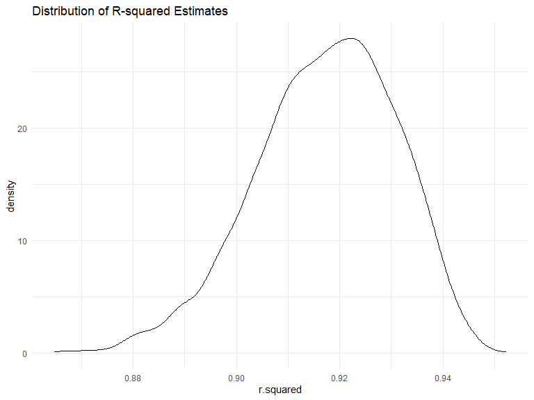
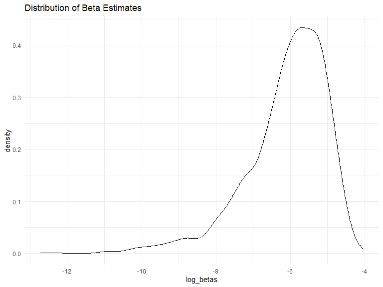
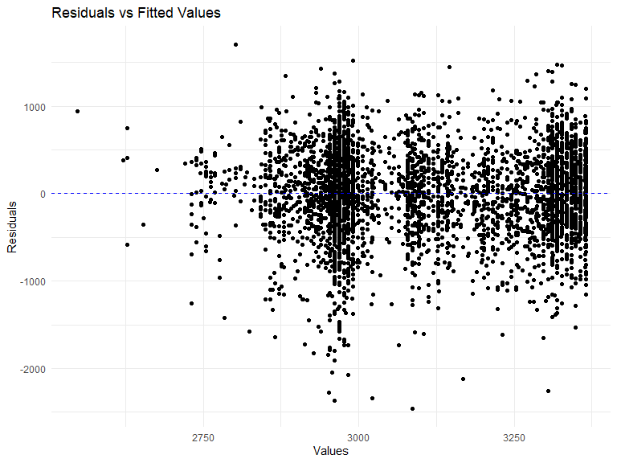
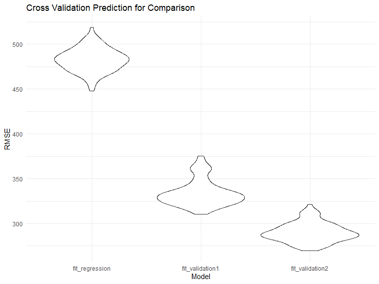

Homework 6
================
Pavithra Srinivasan

``` r
library(tidyverse)
```

    ## ── Attaching core tidyverse packages ──────────────────────── tidyverse 2.0.0 ──
    ## ✔ dplyr     1.1.4     ✔ readr     2.1.4
    ## ✔ forcats   1.0.0     ✔ stringr   1.5.1
    ## ✔ ggplot2   3.4.4     ✔ tibble    3.2.1
    ## ✔ lubridate 1.9.3     ✔ tidyr     1.3.0
    ## ✔ purrr     1.0.2     
    ## ── Conflicts ────────────────────────────────────────── tidyverse_conflicts() ──
    ## ✖ dplyr::filter() masks stats::filter()
    ## ✖ dplyr::lag()    masks stats::lag()
    ## ℹ Use the conflicted package (<http://conflicted.r-lib.org/>) to force all conflicts to become errors

``` r
library(viridis)
```

    ## Loading required package: viridisLite

``` r
library(modelr)
library(ggplot2)
library(purrr)

knitr::opts_chunk$set(
    echo = TRUE,
    warning = FALSE,
    fig.width = 8, 
  fig.height = 6,
  out.width = "90%"
)

options(
  ggplot2.continuous.colour = "viridis",
  ggplot2.continuous.fill = "viridis"
)

scale_colour_discrete = scale_colour_viridis_d
scale_fill_discrete = scale_fill_viridis_d

theme_set(theme_minimal() + theme(legend.position = "bottom"))
```

### Problem 1 - Solution Already Provided

In the data cleaning code below we create a `city_state` variable,
change `victim_age` to numeric, modifiy victim_race to have categories
white and non-white, with white as the reference category, and create a
`resolution` variable indicating whether the homicide is solved. Lastly,
we filtered out the following cities: Tulsa, AL; Dallas, TX; Phoenix,
AZ; and Kansas City, MO; and we retained only the variables
`city_state`, `resolution`, `victim_age`, `victim_sex`, and
`victim_race`.

``` r
homicide_df = 
  read_csv("data/homicide-data.csv", na = c("", "NA", "Unknown")) |> 
  mutate(
    city_state = str_c(city, state, sep = ", "),
    victim_age = as.numeric(victim_age),
    resolution = case_when(
      disposition == "Closed without arrest" ~ 0,
      disposition == "Open/No arrest"        ~ 0,
      disposition == "Closed by arrest"      ~ 1)
  ) |> 
  filter(victim_race %in% c("White", "Black")) |> 
  filter(!(city_state %in% c("Tulsa, AL", "Dallas, TX", "Phoenix, AZ", "Kansas City, MO"))) |> 
  select(city_state, resolution, victim_age, victim_sex, victim_race)
```

    ## Rows: 52179 Columns: 12
    ## ── Column specification ────────────────────────────────────────────────────────
    ## Delimiter: ","
    ## chr (8): uid, victim_last, victim_first, victim_race, victim_sex, city, stat...
    ## dbl (4): reported_date, victim_age, lat, lon
    ## 
    ## ℹ Use `spec()` to retrieve the full column specification for this data.
    ## ℹ Specify the column types or set `show_col_types = FALSE` to quiet this message.

Next we fit a logistic regression model using only data from Baltimore,
MD. We model `resolved` as the outcome and `victim_age`, `victim_sex`,
and `victim_race` as predictors. We save the output as `baltimore_glm`
so that we can apply `broom::tidy` to this object and obtain the
estimate and confidence interval of the adjusted odds ratio for solving
homicides comparing non-white victims to white victims.

``` r
baltimore_glm = 
  filter(homicide_df, city_state == "Baltimore, MD") |> 
  glm(resolution ~ victim_age + victim_sex + victim_race, family = binomial(), data = _)

baltimore_glm |> 
  broom::tidy() |> 
  mutate(
    OR = exp(estimate), 
    OR_CI_upper = exp(estimate + 1.96 * std.error),
    OR_CI_lower = exp(estimate - 1.96 * std.error)) |> 
  filter(term == "victim_sexMale") |> 
  select(OR, OR_CI_lower, OR_CI_upper) |>
  knitr::kable(digits = 3)
```

|    OR | OR_CI_lower | OR_CI_upper |
|------:|------------:|------------:|
| 0.426 |       0.325 |       0.558 |

Below, by incorporating `nest()`, `map()`, and `unnest()` into the
preceding Baltimore-specific code, we fit a model for each of the
cities, and extract the adjusted odds ratio (and CI) for solving
homicides comparing non-white victims to white victims. We show the
first 5 rows of the resulting dataframe of model results.

``` r
model_results = 
  homicide_df |> 
  nest(data = -city_state) |> 
  mutate(
    models = map(data, \(df) glm(resolution ~ victim_age + victim_sex + victim_race, 
                             family = binomial(), data = df)),
    tidy_models = map(models, broom::tidy)) |> 
  select(-models, -data) |> 
  unnest(cols = tidy_models) |> 
  mutate(
    OR = exp(estimate), 
    OR_CI_upper = exp(estimate + 1.96 * std.error),
    OR_CI_lower = exp(estimate - 1.96 * std.error)) |> 
  filter(term == "victim_sexMale") |> 
  select(city_state, OR, OR_CI_lower, OR_CI_upper)

model_results |>
  slice(1:5) |> 
  knitr::kable(digits = 3)
```

| city_state      |    OR | OR_CI_lower | OR_CI_upper |
|:----------------|------:|------------:|------------:|
| Albuquerque, NM | 1.767 |       0.831 |       3.761 |
| Atlanta, GA     | 1.000 |       0.684 |       1.463 |
| Baltimore, MD   | 0.426 |       0.325 |       0.558 |
| Baton Rouge, LA | 0.381 |       0.209 |       0.695 |
| Birmingham, AL  | 0.870 |       0.574 |       1.318 |

Below we generate a plot of the estimated ORs and CIs for each city,
ordered by magnitude of the OR from smallest to largest. From this plot
we see that most cities have odds ratios that are smaller than 1,
suggesting that crimes with male victims have smaller odds of resolution
compared to crimes with female victims after adjusting for victim age
and race. This disparity is strongest in New yrok. In roughly half of
these cities, confidence intervals are narrow and do not contain 1,
suggesting a significant difference in resolution rates by sex after
adjustment for victim age and race.

``` r
model_results |> 
  mutate(city_state = fct_reorder(city_state, OR)) |> 
  ggplot(aes(x = city_state, y = OR)) + 
  geom_point() + 
  geom_errorbar(aes(ymin = OR_CI_lower, ymax = OR_CI_upper)) + 
  theme(axis.text.x = element_text(angle = 90, hjust = 1))
```


### Problem 2

Importing and reading in the data using code given:

``` r
weather_df = 
  rnoaa::meteo_pull_monitors(
    c("USW00094728"),
    var = c("PRCP", "TMIN", "TMAX"), 
    date_min = "2022-01-01",
    date_max = "2022-12-31") |>
  mutate(
    name = recode(id, USW00094728 = "CentralPark_NY"),
    tmin = tmin / 10,
    tmax = tmax / 10) |>
  select(name, id, everything())
```

    ## using cached file: C:\Users\pavit\AppData\Local/R/cache/R/rnoaa/noaa_ghcnd/USW00094728.dly

    ## date created (size, mb): 2023-12-21 15:22:15.264591 (8.575)

    ## file min/max dates: 1869-01-01 / 2023-12-31

##### Build a regression model:

``` r
model_tmax <- lm(tmax ~ tmin + prcp, data = weather_df)
summary(model_tmax)
```

    ## 
    ## Call:
    ## lm(formula = tmax ~ tmin + prcp, data = weather_df)
    ## 
    ## Residuals:
    ##     Min      1Q  Median      3Q     Max 
    ## -6.3705 -1.9950 -0.0249  1.4974 20.4503 
    ## 
    ## Coefficients:
    ##              Estimate Std. Error t value Pr(>|t|)    
    ## (Intercept)  8.042803   0.230065  34.959   <2e-16 ***
    ## tmin         1.013386   0.016154  62.734   <2e-16 ***
    ## prcp        -0.001541   0.002103  -0.733    0.464    
    ## ---
    ## Signif. codes:  0 '***' 0.001 '**' 0.01 '*' 0.05 '.' 0.1 ' ' 1
    ## 
    ## Residual standard error: 2.956 on 362 degrees of freedom
    ## Multiple R-squared:  0.916,  Adjusted R-squared:  0.9155 
    ## F-statistic:  1972 on 2 and 362 DF,  p-value: < 2.2e-16

##### Bootstrap analysis:

``` r
set.seed(123)
```

##### Writing a function to generate 5000 bootstraps samples

``` r
boot_sample = function(df) {
  sample_frac(df, replace = TRUE)
}
```

##### 5000 bootstraps samples:

``` r
boot_straps = 
  tibble(strap_number = 1:5000) |> 
  mutate(
    strap_sample = map(strap_number, \(i) boot_sample(df = weather_df))
  )

boot_straps
```

    ## # A tibble: 5,000 × 2
    ##    strap_number strap_sample      
    ##           <int> <list>            
    ##  1            1 <tibble [365 × 6]>
    ##  2            2 <tibble [365 × 6]>
    ##  3            3 <tibble [365 × 6]>
    ##  4            4 <tibble [365 × 6]>
    ##  5            5 <tibble [365 × 6]>
    ##  6            6 <tibble [365 × 6]>
    ##  7            7 <tibble [365 × 6]>
    ##  8            8 <tibble [365 × 6]>
    ##  9            9 <tibble [365 × 6]>
    ## 10           10 <tibble [365 × 6]>
    ## # ℹ 4,990 more rows

##### Combine all the bootstraps results

``` r
combined_results <- 
  boot_straps |> 
  mutate(
    models = map(strap_sample, ~lm(tmax ~ tmin + prcp, data = .x) ),
    results = map(models, broom::glance)) |>
  select(-strap_sample, -models) |>
  unnest(results) 
```

##### Compute the R-Squared

``` r
r_squared <- 
  combined_results |>
  select(r.squared, strap_number)
```

##### Generating estimates

``` r
combined_results2 = 
  boot_straps |> 
  mutate(
    models = map(strap_sample, ~lm(tmax ~ tmin + prcp, data = .x) ),
    results = map(models, broom::tidy)) |> 
  select(-strap_sample, -models) |> 
  unnest(results) 
```

##### Log of the product of beta estimates

``` r
log_betas <-  
  combined_results2 |>
  group_by(strap_number) |>
  summarise(log_betas = log(estimate[2] * estimate[3])) |>
  select(log_betas, strap_number)
```

##### Density Plot of R-squared

``` r
r_squared_sd <-
  r_squared |>
  summarise(r_squared_sd = sd(r.squared)) |>
  pull(r_squared_sd)

r_squared_mean <-
  r_squared |>
  summarise(r_squared_mean = mean(r.squared)) |>
  pull(r_squared_mean)

r_squared |>
  ggplot(aes(x = r.squared)) + geom_density()+
  labs(title = "Distribution of R-squared Estimates")
```



The density curve of R-Squared $\hat r^2$ is skewed to the left. The
mean is 0.9173 and standard deviation is0.0136.

##### Density plot of the product of beta estimates

``` r
  beta_sd <- 
  log_betas |>
  summarise(beta_sd = sd(as.numeric(log_betas),na.rm = TRUE)) |>
  pull(beta_sd)

  betas_mean <- 
  log_betas |>
  summarise(betas_mean = mean(as.numeric(log_betas), na.rm = TRUE)) |>
  pull(betas_mean)

log_betas |>
  ggplot(aes(x = log_betas)) + geom_density() +
  labs(title = "Distribution of Beta Estimates")
```



The density curve of the the product of two beta estimates is
left-skewed. The mean is -6.106, and the standard deviation is 1.1136.

##### 95% CI of the R-Squared

``` r
CI_interval <-
  r_squared |>
  summarize(ci_lower = quantile(r.squared, 0.025),
            ci_upper = quantile(r.squared, 0.975)) 

CI_result_lower <- CI_interval |> pull(ci_lower)
CI_result_upper <- CI_interval |> pull(ci_upper)
```

The 95% Confidence Interval of the R-squared estimates $\hat r^2$ is
(0.8882,0.9403).

##### 95% CI of log of the product of beta estimates

``` r
CI_interval2 <-
  log_betas |>
  summarize(ci_lower = quantile(log_betas, 0.025, na.rm = TRUE),
            ci_upper = quantile(log_betas, 0.975, na.rm = TRUE))

CI_result_lower2 <- CI_interval2 |> pull(ci_lower)
CI_result_upper2 <- CI_interval2 |> pull(ci_upper)
```

The 95% Confidence Interval of the product of beta estimates
$\log(\hat\beta_1\times \hat\beta_2)$ is (-9.0632,-4.6193).

### Problem 3

##### Importing and Cleaning the Data

``` r
birth_weight = read_csv("./data/birthweight.csv")
```

    ## Rows: 4342 Columns: 20
    ## ── Column specification ────────────────────────────────────────────────────────
    ## Delimiter: ","
    ## dbl (20): babysex, bhead, blength, bwt, delwt, fincome, frace, gaweeks, malf...
    ## 
    ## ℹ Use `spec()` to retrieve the full column specification for this data.
    ## ℹ Specify the column types or set `show_col_types = FALSE` to quiet this message.

``` r
birthweight_clean = birth_weight|>
  mutate(mrace = as.factor(mrace))|>
  mutate(malform = as.factor(malform))|>
  mutate(babysex = as.factor(babysex))

 birthweight_model = birthweight_clean|>
   mutate(mrace = case_match(mrace,
                              "1" ~ "White",
                              "2" ~ "Black",
                              "3" ~ "Asian",
                              "4" ~ "Puerto Rican"
                          ))|>
   mutate(malform = case_match(malform,
                               "0" ~ "absent",
                               "1" ~ "present"))
```

##### Proposed Regression Line

The predictors I chose were: `fincome`, `malform`, `mrace`, and
`smoken`. Income can act as a huge barrier and can influence the
surroundings of those who are pregnant and the quality of nutrition.
Additionally, this can also tell us the birth weight of the infant in
which the mother’s drug habits like cigarette smoking is tested. Other
confounding variables were chosen such as race to see if these factors
gave an affect on birth weight.

``` r
fit_regression = lm(bwt ~ fincome + malform + mrace + smoken,
           data = birthweight_model)
```

##### Plot of Residuals Against Fitted Values

``` r
birthweight_model = birthweight_model|>
  add_residuals(fit_regression, var = "residuals")|>
  add_predictions(fit_regression, var = "fit")

ggplot(birthweight_model, aes(x= fit, y = residuals))+
  geom_point()+
  geom_hline(yintercept = 0, linetype = "dashed", color = "blue") +
  labs(title = "Residuals vs Fitted Values",
       x = "Values",
       y = "Residuals")
```



Observation: Most of the data points gathered around where the residual
was 0. However, there are some outliers that should be takes note of
because of the potential effects it might introduce to statistical
analysis being conducted. Overall, there were not significant trends
observed between the residuals and the values.

##### Cross Validated Prediction Error to Compare:

Predictors for fit model 1: birth length and gestational age Predictors
for fit model 2: head circumference, length and sex (combinations of
them too)

``` r
fit_validation1 = lm(bwt ~ blength + gaweeks, data = birth_weight)
fit_validation2 = lm(bwt ~ bhead + blength + babysex + bhead*blength + bhead*babysex + blength*babysex, data = birthweight_clean)
```

``` r
validation_df =
  crossv_mc(birthweight_clean, 100) |> 
  mutate(
    train = map(train, as_tibble),
    test = map(test, as_tibble))

validation_df = 
  validation_df |> 
  mutate(
    fit_regression  = map(train, \(df) lm(bwt ~ fincome + malform + mrace + smoken,
           data = df)),
    fit_validation1  = map(train, \(df) lm(bwt ~ blength + gaweeks, data = df)),
    fit_validation2  = map(train, \(df) lm(bwt ~ bhead + blength + babysex + bhead*blength + bhead*babysex + blength*babysex, data = df))) |> 
  mutate(
    rmse_fit_regression = map2_dbl(fit_regression, test, \(mod, df) rmse(model = mod, data = df)),
    rmse_fit_validation1 = map2_dbl(fit_validation1, test, \(mod, df) rmse(model = mod, data = df)),
    rmse_fit_validation2 = map2_dbl(fit_validation2, test, \(mod, df) rmse(model = mod, data = df)))
```

##### Plotting the Cross Validation Predictor Error Model

``` r
validation_df |> 
  select(starts_with("rmse")) |> 
  pivot_longer(
    everything(),
    names_to = "model", 
    values_to = "rmse",
    names_prefix = "rmse_") |> 
  mutate(model = fct_inorder(model)) |> 
  ggplot(aes(x = model, y = rmse)) + geom_violin()+
  labs(title = "Cross Validation Prediction for Comparison",
        x = "Model",
       y = "RMSE")
```



Based on the RMSE v.s Model graph, we can see that fit model 2 which
includes head circumference, length, sex had the lowest RMSE. This may
be the optimal choice in comparison to the regression. It should also be
noted Model 2 had more variables to be addressed compared to the other
ones.
